

> **الوثيقة:** مخططات التسلسل للحالات الأساسية (Sequence Diagrams) — **النظام:** OptiTime — **التاريخ:** 2026-11-14

# مخططات التسلسل للحالات الأساسية — نظام OptiTime

تضم هذه الوثيقة ثمانية مخططات تسلسل لأهم حالات الاستخدام في النظام، لكل منها نسخة إنجليزية ونسخة عربية. ويُظهر كل مخطط ما يجري داخل الخادم: المكوّنات التي تستقبل الطلب وتعالجه، وترتيب طلباتها، وشروط البدائل فيها، دون واجهة المستخدم وقاعدة البيانات.

**الملفات:** النسخة الإنجليزية في مجلد `English` والعربية في مجلد `Arabic`، ولكل منهما كود المخططات في `Src` وصورها في `Images` بالاسم نفسه.

## قواعد الرسم

- يبدأ المخطط بالفاعل، وتليه مكوّنات الخادم بترتيب طلباتها داخل إطار «الخادم»، ولا تظهر واجهة المستخدم ولا قاعدة البيانات؛ فالحفظ خطوة يقوم بها المكوّن نفسه.
- كل رسالة جملة قصيرة تبدأ بفعل، وكل رد اسم ما يعود به.
- النمط نفسه في مخططات النشاط: خط Tahoma، ومستطيلات بيضاء بزوايا مستديرة، وإطارات الشروط بالأصفر.

| الرمز | معناه |
|---|---|
| الفاعل | الشخص الذي يبدأ الحالة، أو يتلقى إشعاراً منها |
| إطار «الخادم» | مكوّنات الخادم التي تعالج الطلب، كلٌّ في مستطيل باسمه |
| سهم متصل برأس مصمت | طلب من مكوّن إلى آخر |
| سهم متقطع | رد على طلب |
| سهم برأس مفتوح | إشعار يُرسل دون انتظار رد |
| سهم يعود إلى المكوّن نفسه | خطوة يقوم بها المكوّن داخلياً |
| إطار alt | بدائل، لكل منها شرطه بين قوسين |
| إطار opt | خطوة تحدث عند شرطها فقط |
| إطار loop | تكرار بشرطه |

## فهرس المخططات

| الرقم | الحالة | الفاعل | مكوّنات الخادم |
|---|---|---|---|
| 1 | UC-27 إدخال أوقات التفرّغ | عضو هيئة التدريس | متحكم أوقات التفرّغ، وخدمة أوقات التفرّغ، وخدمة الإشعارات |
| 2 | UC-29 توليد الجدول الدراسي | منسق الجداول والموارد | متحكم التوليد، ومعالج المهام، وخدمة التوليد، ومحرك الجدولة، وخدمة الإشعارات |
| 3 | UC-61 معالجة تعارضات الجدول ومؤشر الجودة | منسق الجداول والموارد | متحكم الجدول، وخدمة التعارضات، وباحث الاقتراحات، وخدمة توزيع الطلاب |
| 4 | UC-31 اعتماد الجدول ونشره | موظف الشؤون الأكاديمية | متحكم نسخ الجدول، وخدمة نسخ الجدول، وخدمة توزيع الطلاب، وخدمة الإشعارات |
| 5 | UC-67 تسجيل المقررات | الطالب | متحكم التسجيل، وفاحص الأهلية، ومدير المقاعد، وخدمة تأكيد السلة، وخدمة الفواتير |
| 6 | UC-84 جدولة الامتحانات | موظف شؤون الامتحانات | متحكم الامتحانات، ومنشئ قائمة الامتحانات، ومحرك جدولة الامتحانات، وخدمة الإشعارات |
| 7 | UC-80 الإدخال المزدوج واعتماد الكشوف ونشرها | موظف شؤون الامتحانات | متحكم كشوف العلامات، وخدمة التحقق، ودفتر العلامات، ومهمة النشر في الخلفية |
| 8 | UC-105 محادثة المساعد الذكي | أي مستخدم في النظام | متحكم المساعد، وبوابة الذكاء، والمساعد، ومنفّذ الأدوات، وخدمة الذكاء الاصطناعي، والنموذج اللغوي |

---

## UC-27: إدخال أوقات التفرّغ

**الفاعل:** عضو هيئة التدريس. **ما يجري في الخادم:** يستلم متحكم أوقات التفرّغ الأسبوع ويطلب حفظه، فتتحقق خدمة أوقات التفرّغ من أن النافذة مفتوحة وتفحص كل خانة. فإن كانت النافذة مغلقة عُرض الأسبوع للقراءة فقط، وإن كانت خانة غير صالحة رُفض الحفظ مع السبب. وإلا حُفظ الأسبوع في عملية واحدة، وأُشعر المنسقون إن سُلّم، وسُجّلت العملية في سجل التدقيق.

**النسخة العربية:**

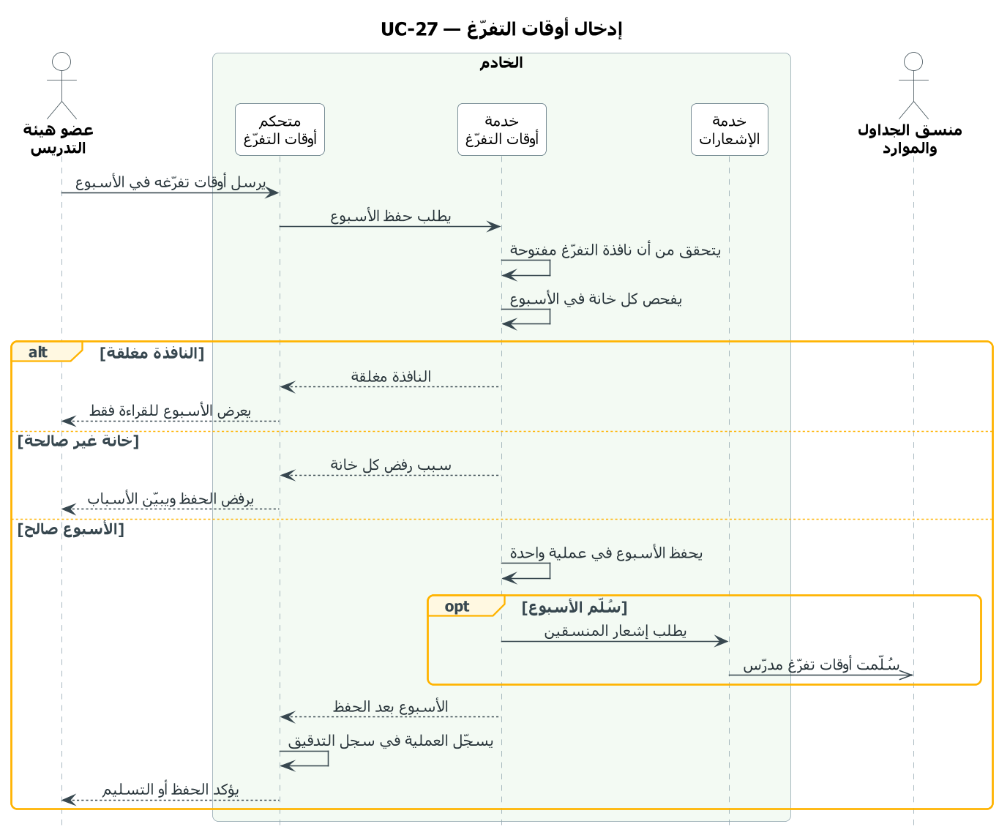

**النسخة الإنجليزية:**

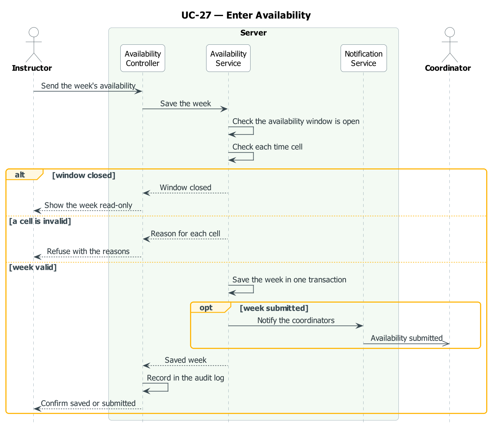

**كود النسخة العربية:**

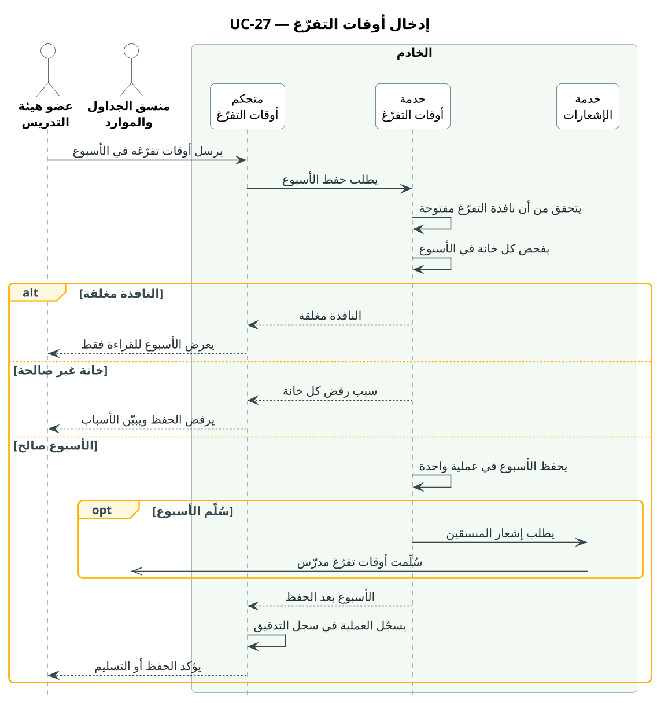
```plantuml
@startuml UC-27_enter_availability
skinparam dpi 150
' ===== النمط الموحّد (مثل مخططات النشاط) =====
skinparam defaultFontName Tahoma
skinparam defaultFontSize 13
skinparam shadowing false
skinparam roundcorner 10
skinparam ArrowColor #37474F
skinparam ArrowFontColor #263238
skinparam TitleFontSize 16
skinparam TitleFontStyle bold
skinparam ParticipantBackgroundColor #FFFFFF
skinparam ParticipantBorderColor #546E7A
skinparam ParticipantFontSize 13
skinparam ActorBackgroundColor #FFFFFF
skinparam ActorBorderColor #37474F
skinparam ActorFontSize 13
skinparam ActorFontStyle bold
skinparam SequenceLifeLineBorderColor #90A4AE
skinparam SequenceBoxBorderColor #90A4AE
skinparam SequenceBoxFontSize 14
skinparam SequenceBoxFontStyle bold
skinparam SequenceGroupBorderColor #FFB300
skinparam SequenceGroupBackgroundColor #FFF8E1
skinparam SequenceGroupFontColor #37474F
skinparam SequenceGroupHeaderFontColor #37474F
skinparam sequenceMessageAlign center
skinparam ParticipantPadding 16
skinparam BoxPadding 12
hide footbox
' ===== المخطط =====
title UC-27 — إدخال أوقات التفرّغ

actor "عضو هيئة\nالتدريس" as U
actor "منسق الجداول\nوالموارد" as CRD
box "الخادم" #F3FAF3
  participant "متحكم\nأوقات التفرّغ" as AC
  participant "خدمة\nأوقات التفرّغ" as AS
  participant "خدمة\nالإشعارات" as NS
end box

U -> AC : يرسل أوقات تفرّغه في الأسبوع
AC -> AS : يطلب حفظ الأسبوع
AS -> AS : يتحقق من أن نافذة التفرّغ مفتوحة
AS -> AS : يفحص كل خانة في الأسبوع
alt النافذة مغلقة
  AS --> AC : النافذة مغلقة
  AC --> U : يعرض الأسبوع للقراءة فقط
else خانة غير صالحة
  AS --> AC : سبب رفض كل خانة
  AC --> U : يرفض الحفظ ويبيّن الأسباب
else الأسبوع صالح
  AS -> AS : يحفظ الأسبوع في عملية واحدة
  opt سُلّم الأسبوع
    AS -> NS : يطلب إشعار المنسقين
    NS ->> CRD : سُلّمت أوقات تفرّغ مدرّس
  end
  AS --> AC : الأسبوع بعد الحفظ
  AC -> AC : يسجّل العملية في سجل التدقيق
  AC --> U : يؤكد الحفظ أو التسليم
end
@enduml
```

**كود النسخة الإنجليزية:**

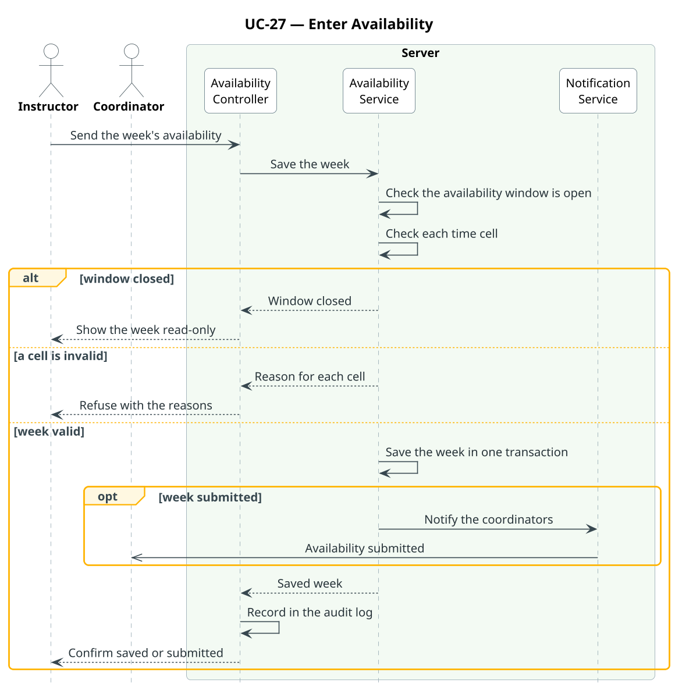
```plantuml
@startuml UC-27_enter_availability
skinparam dpi 150
' ===== النمط الموحّد (مثل مخططات النشاط) =====
skinparam defaultFontName Tahoma
skinparam defaultFontSize 13
skinparam shadowing false
skinparam roundcorner 10
skinparam ArrowColor #37474F
skinparam ArrowFontColor #263238
skinparam TitleFontSize 16
skinparam TitleFontStyle bold
skinparam ParticipantBackgroundColor #FFFFFF
skinparam ParticipantBorderColor #546E7A
skinparam ParticipantFontSize 13
skinparam ActorBackgroundColor #FFFFFF
skinparam ActorBorderColor #37474F
skinparam ActorFontSize 13
skinparam ActorFontStyle bold
skinparam SequenceLifeLineBorderColor #90A4AE
skinparam SequenceBoxBorderColor #90A4AE
skinparam SequenceBoxFontSize 14
skinparam SequenceBoxFontStyle bold
skinparam SequenceGroupBorderColor #FFB300
skinparam SequenceGroupBackgroundColor #FFF8E1
skinparam SequenceGroupFontColor #37474F
skinparam SequenceGroupHeaderFontColor #37474F
skinparam sequenceMessageAlign center
skinparam ParticipantPadding 16
skinparam BoxPadding 12
hide footbox
' ===== المخطط =====
title UC-27 — Enter Availability

actor "Instructor" as U
actor "Coordinator" as CRD
box "Server" #F3FAF3
  participant "Availability\nController" as AC
  participant "Availability\nService" as AS
  participant "Notification\nService" as NS
end box

U -> AC : Send the week's availability
AC -> AS : Save the week
AS -> AS : Check the availability window is open
AS -> AS : Check each time cell
alt window closed
  AS --> AC : Window closed
  AC --> U : Show the week read-only
else a cell is invalid
  AS --> AC : Reason for each cell
  AC --> U : Refuse with the reasons
else week valid
  AS -> AS : Save the week in one transaction
  opt week submitted
    AS -> NS : Notify the coordinators
    NS ->> CRD : Availability submitted
  end
  AS --> AC : Saved week
  AC -> AC : Record in the audit log
  AC --> U : Confirm saved or submitted
end
@enduml
```

---

## UC-29: توليد الجدول الدراسي

**الفاعل:** منسق الجداول والموارد. **ما يجري في الخادم:** ينشئ متحكم التوليد مهمة في الانتظار ويرد فوراً، ثم يأخذها معالج المهام الذي يعمل كل دقيقة. وتحمّل خدمة التوليد القاعات والشعب وأوقات التفرّغ والقواعد، فإن نقصت القواعد توقفت، وإلا شغّلت محرك الجدولة بالخوارزمية المختارة حتى انتهاء المهلة أو توقف التحسّن، ثم تحققت من القيود الصلبة وقاست الجودة. ويحفظ المعالج النتيجة ويُبلَّغ المنسق.

**النسخة العربية:**

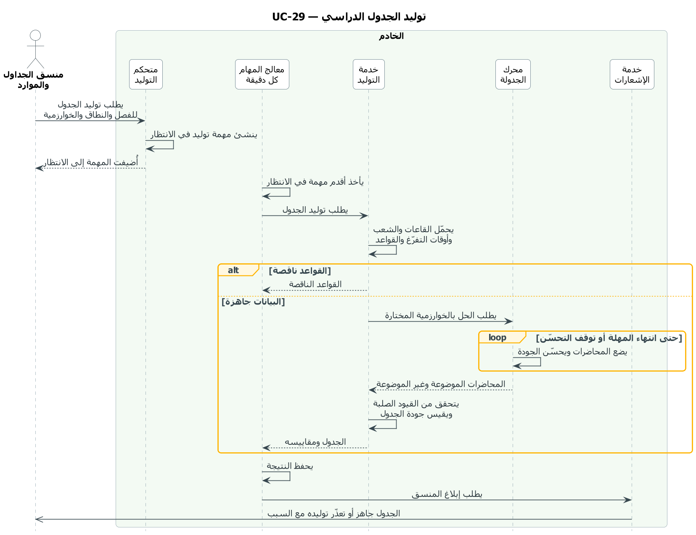

**النسخة الإنجليزية:**

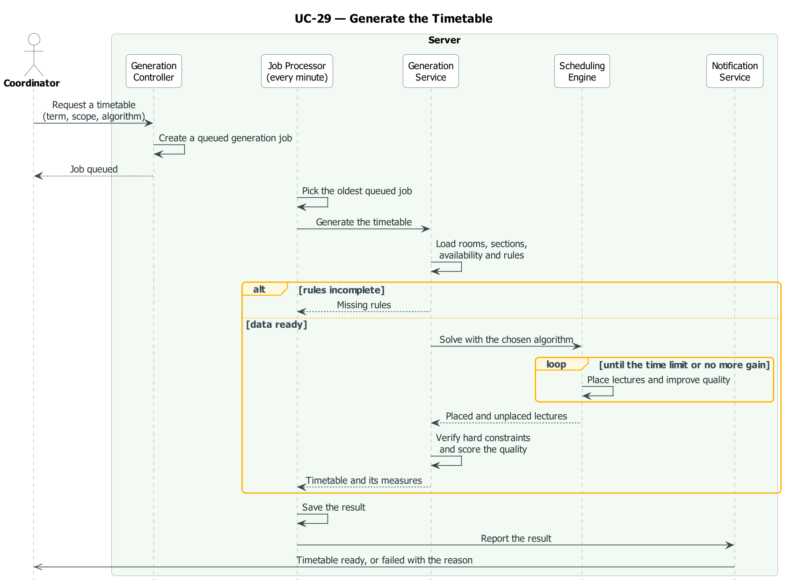

**كود النسخة العربية:**

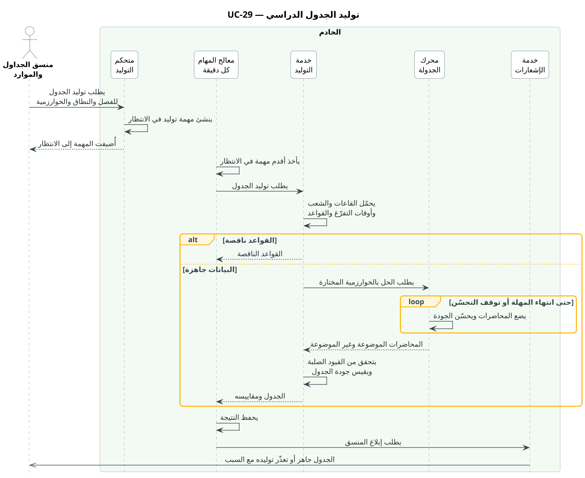
```plantuml
@startuml UC-29_generate_run
skinparam dpi 150
' ===== النمط الموحّد (مثل مخططات النشاط) =====
skinparam defaultFontName Tahoma
skinparam defaultFontSize 13
skinparam shadowing false
skinparam roundcorner 10
skinparam ArrowColor #37474F
skinparam ArrowFontColor #263238
skinparam TitleFontSize 16
skinparam TitleFontStyle bold
skinparam ParticipantBackgroundColor #FFFFFF
skinparam ParticipantBorderColor #546E7A
skinparam ParticipantFontSize 13
skinparam ActorBackgroundColor #FFFFFF
skinparam ActorBorderColor #37474F
skinparam ActorFontSize 13
skinparam ActorFontStyle bold
skinparam SequenceLifeLineBorderColor #90A4AE
skinparam SequenceBoxBorderColor #90A4AE
skinparam SequenceBoxFontSize 14
skinparam SequenceBoxFontStyle bold
skinparam SequenceGroupBorderColor #FFB300
skinparam SequenceGroupBackgroundColor #FFF8E1
skinparam SequenceGroupFontColor #37474F
skinparam SequenceGroupHeaderFontColor #37474F
skinparam sequenceMessageAlign center
skinparam ParticipantPadding 16
skinparam BoxPadding 12
hide footbox
' ===== المخطط =====
title UC-29 — توليد الجدول الدراسي

actor "منسق الجداول\nوالموارد" as U
box "الخادم" #F3FAF3
  participant "متحكم\nالتوليد" as GC
  participant "معالج المهام\nكل دقيقة" as JP
  participant "خدمة\nالتوليد" as GS
  participant "محرك\nالجدولة" as SE
  participant "خدمة\nالإشعارات" as NS
end box

U -> GC : يطلب توليد الجدول\nللفصل والنطاق والخوارزمية
GC -> GC : ينشئ مهمة توليد في الانتظار
GC --> U : أُضيفت المهمة إلى الانتظار
JP -> JP : يأخذ أقدم مهمة في الانتظار
JP -> GS : يطلب توليد الجدول
GS -> GS : يحمّل القاعات والشعب\nوأوقات التفرّغ والقواعد
alt القواعد ناقصة
  GS --> JP : القواعد الناقصة
else البيانات جاهزة
  GS -> SE : يطلب الحل بالخوارزمية المختارة
  loop حتى انتهاء المهلة أو توقف التحسّن
    SE -> SE : يضع المحاضرات ويحسّن الجودة
  end
  SE --> GS : المحاضرات الموضوعة وغير الموضوعة
  GS -> GS : يتحقق من القيود الصلبة\nويقيس جودة الجدول
  GS --> JP : الجدول ومقاييسه
end
JP -> JP : يحفظ النتيجة
JP -> NS : يطلب إبلاغ المنسق
NS ->> U : الجدول جاهز أو تعذّر توليده مع السبب
@enduml
```

**كود النسخة الإنجليزية:**

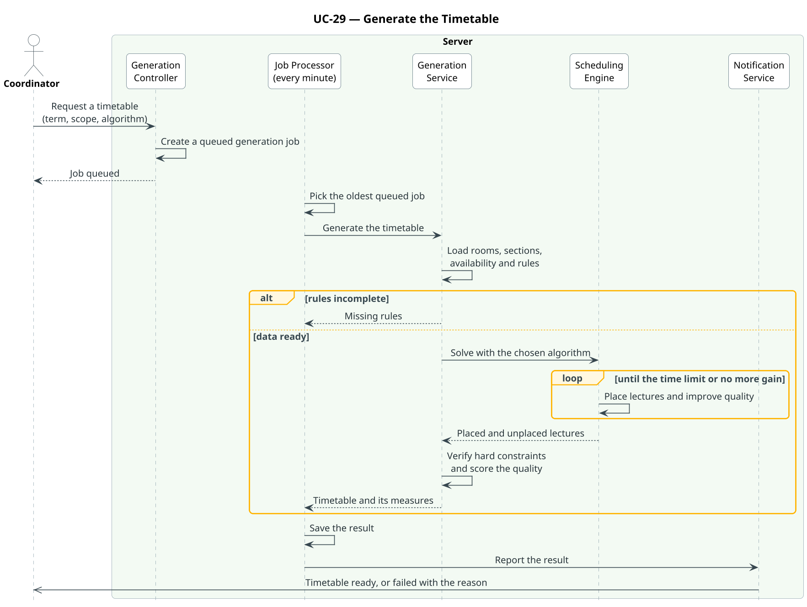
```plantuml
@startuml UC-29_generate_run
skinparam dpi 150
' ===== النمط الموحّد (مثل مخططات النشاط) =====
skinparam defaultFontName Tahoma
skinparam defaultFontSize 13
skinparam shadowing false
skinparam roundcorner 10
skinparam ArrowColor #37474F
skinparam ArrowFontColor #263238
skinparam TitleFontSize 16
skinparam TitleFontStyle bold
skinparam ParticipantBackgroundColor #FFFFFF
skinparam ParticipantBorderColor #546E7A
skinparam ParticipantFontSize 13
skinparam ActorBackgroundColor #FFFFFF
skinparam ActorBorderColor #37474F
skinparam ActorFontSize 13
skinparam ActorFontStyle bold
skinparam SequenceLifeLineBorderColor #90A4AE
skinparam SequenceBoxBorderColor #90A4AE
skinparam SequenceBoxFontSize 14
skinparam SequenceBoxFontStyle bold
skinparam SequenceGroupBorderColor #FFB300
skinparam SequenceGroupBackgroundColor #FFF8E1
skinparam SequenceGroupFontColor #37474F
skinparam SequenceGroupHeaderFontColor #37474F
skinparam sequenceMessageAlign center
skinparam ParticipantPadding 16
skinparam BoxPadding 12
hide footbox
' ===== المخطط =====
title UC-29 — Generate the Timetable

actor "Coordinator" as U
box "Server" #F3FAF3
  participant "Generation\nController" as GC
  participant "Job Processor\n(every minute)" as JP
  participant "Generation\nService" as GS
  participant "Scheduling\nEngine" as SE
  participant "Notification\nService" as NS
end box

U -> GC : Request a timetable\n(term, scope, algorithm)
GC -> GC : Create a queued generation job
GC --> U : Job queued
JP -> JP : Pick the oldest queued job
JP -> GS : Generate the timetable
GS -> GS : Load rooms, sections,\navailability and rules
alt rules incomplete
  GS --> JP : Missing rules
else data ready
  GS -> SE : Solve with the chosen algorithm
  loop until the time limit or no more gain
    SE -> SE : Place lectures and improve quality
  end
  SE --> GS : Placed and unplaced lectures
  GS -> GS : Verify hard constraints\nand score the quality
  GS --> JP : Timetable and its measures
end
JP -> JP : Save the result
JP -> NS : Report the result
NS ->> U : Timetable ready, or failed with the reason
@enduml
```

---

## UC-61: معالجة تعارضات الجدول ومؤشر الجودة

**الفاعل:** منسق الجداول والموارد. **ما يجري في الخادم:** تحدد خدمة التعارضات التعارضات الصلبة والمرنة في النسخة وتحسب مؤشر الجودة. وعند طلب حلول لتعارض يجرّب باحث الاقتراحات النقل والتبديل والقاعة البديلة ويرتّبها بأثرها في الجودة. وعند تطبيق حل يتحقق المتحكم من أن النسخة قابلة للتعديل، ثم يحفظها ويعيد توزيع الطلاب، فيتراجع إن ظهرت مشكلات، وإلا أعاد فحص التعارضات.

**النسخة العربية:**

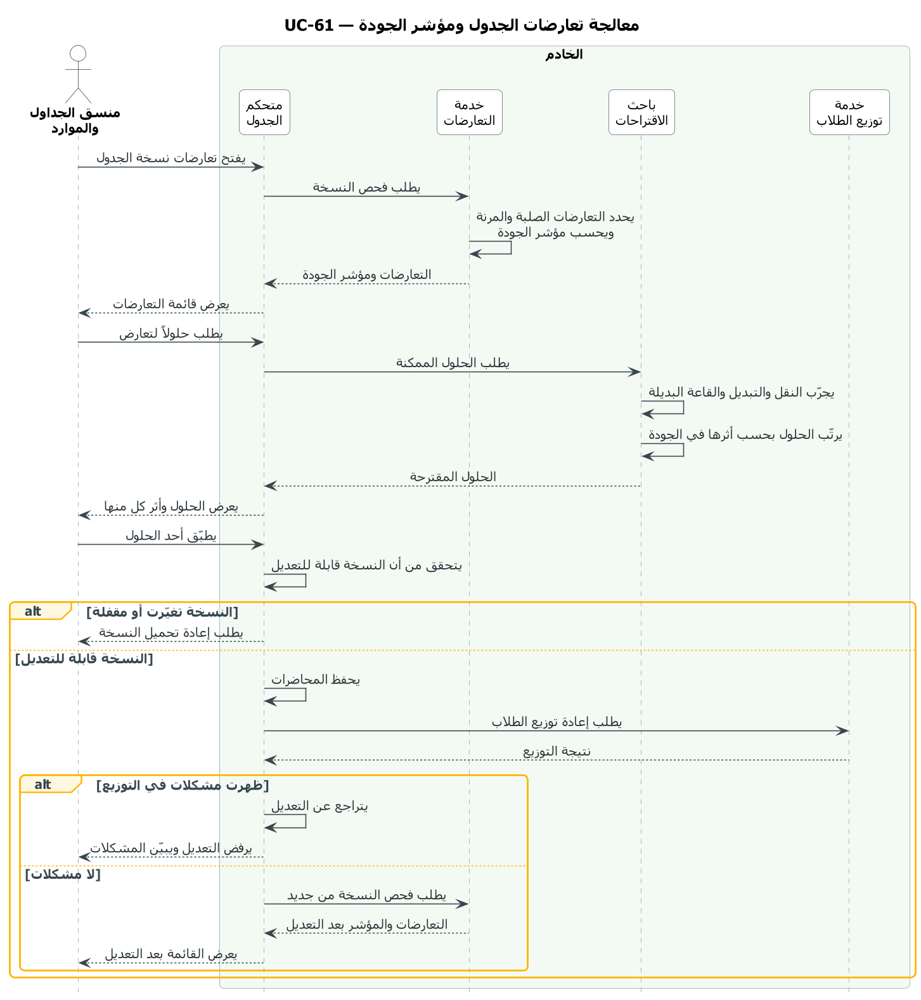

**النسخة الإنجليزية:**

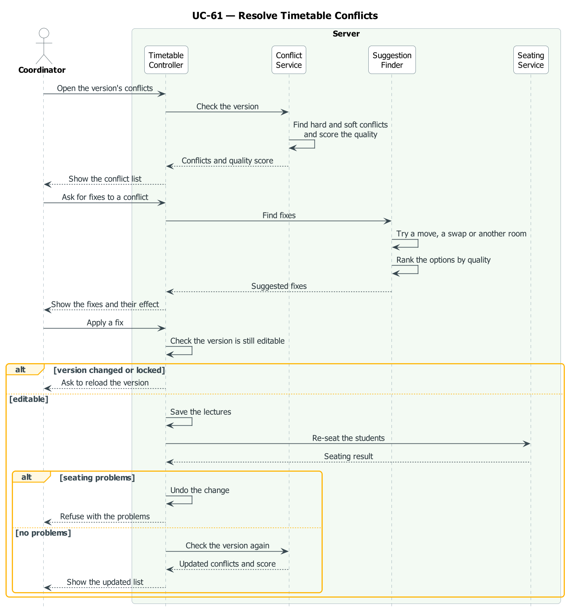

**كود النسخة العربية:**

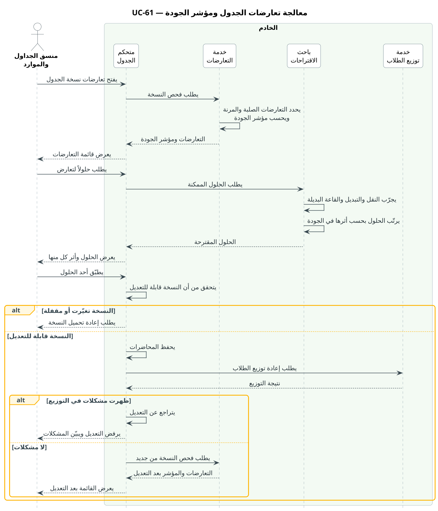
```plantuml
@startuml UC-61_schedule_conflicts
skinparam dpi 150
' ===== النمط الموحّد (مثل مخططات النشاط) =====
skinparam defaultFontName Tahoma
skinparam defaultFontSize 13
skinparam shadowing false
skinparam roundcorner 10
skinparam ArrowColor #37474F
skinparam ArrowFontColor #263238
skinparam TitleFontSize 16
skinparam TitleFontStyle bold
skinparam ParticipantBackgroundColor #FFFFFF
skinparam ParticipantBorderColor #546E7A
skinparam ParticipantFontSize 13
skinparam ActorBackgroundColor #FFFFFF
skinparam ActorBorderColor #37474F
skinparam ActorFontSize 13
skinparam ActorFontStyle bold
skinparam SequenceLifeLineBorderColor #90A4AE
skinparam SequenceBoxBorderColor #90A4AE
skinparam SequenceBoxFontSize 14
skinparam SequenceBoxFontStyle bold
skinparam SequenceGroupBorderColor #FFB300
skinparam SequenceGroupBackgroundColor #FFF8E1
skinparam SequenceGroupFontColor #37474F
skinparam SequenceGroupHeaderFontColor #37474F
skinparam sequenceMessageAlign center
skinparam ParticipantPadding 16
skinparam BoxPadding 12
hide footbox
' ===== المخطط =====
title UC-61 — معالجة تعارضات الجدول ومؤشر الجودة

actor "منسق الجداول\nوالموارد" as U
box "الخادم" #F3FAF3
  participant "متحكم\nالجدول" as TC
  participant "خدمة\nالتعارضات" as CS
  participant "باحث\nالاقتراحات" as SF
  participant "خدمة\nتوزيع الطلاب" as SS
end box

U -> TC : يفتح تعارضات نسخة الجدول
TC -> CS : يطلب فحص النسخة
CS -> CS : يحدد التعارضات الصلبة والمرنة\nويحسب مؤشر الجودة
CS --> TC : التعارضات ومؤشر الجودة
TC --> U : يعرض قائمة التعارضات
U -> TC : يطلب حلولاً لتعارض
TC -> SF : يطلب الحلول الممكنة
SF -> SF : يجرّب النقل والتبديل والقاعة البديلة
SF -> SF : يرتّب الحلول بحسب أثرها في الجودة
SF --> TC : الحلول المقترحة
TC --> U : يعرض الحلول وأثر كل منها
U -> TC : يطبّق أحد الحلول
TC -> TC : يتحقق من أن النسخة قابلة للتعديل
alt النسخة تغيّرت أو مقفلة
  TC --> U : يطلب إعادة تحميل النسخة
else النسخة قابلة للتعديل
  TC -> TC : يحفظ المحاضرات
  TC -> SS : يطلب إعادة توزيع الطلاب
  SS --> TC : نتيجة التوزيع
  alt ظهرت مشكلات في التوزيع
    TC -> TC : يتراجع عن التعديل
    TC --> U : يرفض التعديل ويبيّن المشكلات
  else لا مشكلات
    TC -> CS : يطلب فحص النسخة من جديد
    CS --> TC : التعارضات والمؤشر بعد التعديل
    TC --> U : يعرض القائمة بعد التعديل
  end
end
@enduml
```

**كود النسخة الإنجليزية:**

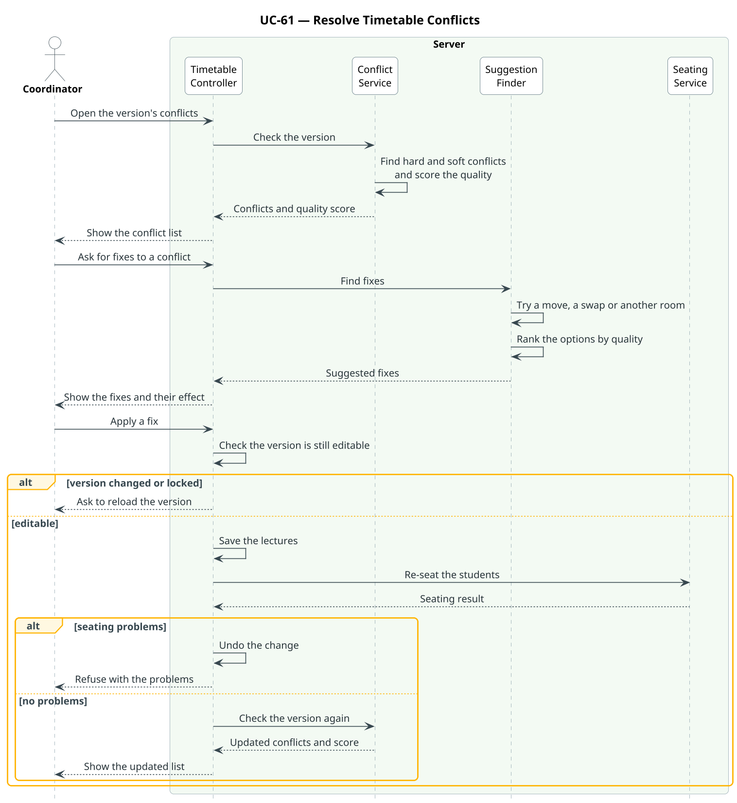
```plantuml
@startuml UC-61_schedule_conflicts
skinparam dpi 150
' ===== النمط الموحّد (مثل مخططات النشاط) =====
skinparam defaultFontName Tahoma
skinparam defaultFontSize 13
skinparam shadowing false
skinparam roundcorner 10
skinparam ArrowColor #37474F
skinparam ArrowFontColor #263238
skinparam TitleFontSize 16
skinparam TitleFontStyle bold
skinparam ParticipantBackgroundColor #FFFFFF
skinparam ParticipantBorderColor #546E7A
skinparam ParticipantFontSize 13
skinparam ActorBackgroundColor #FFFFFF
skinparam ActorBorderColor #37474F
skinparam ActorFontSize 13
skinparam ActorFontStyle bold
skinparam SequenceLifeLineBorderColor #90A4AE
skinparam SequenceBoxBorderColor #90A4AE
skinparam SequenceBoxFontSize 14
skinparam SequenceBoxFontStyle bold
skinparam SequenceGroupBorderColor #FFB300
skinparam SequenceGroupBackgroundColor #FFF8E1
skinparam SequenceGroupFontColor #37474F
skinparam SequenceGroupHeaderFontColor #37474F
skinparam sequenceMessageAlign center
skinparam ParticipantPadding 16
skinparam BoxPadding 12
hide footbox
' ===== المخطط =====
title UC-61 — Resolve Timetable Conflicts

actor "Coordinator" as U
box "Server" #F3FAF3
  participant "Timetable\nController" as TC
  participant "Conflict\nService" as CS
  participant "Suggestion\nFinder" as SF
  participant "Seating\nService" as SS
end box

U -> TC : Open the version's conflicts
TC -> CS : Check the version
CS -> CS : Find hard and soft conflicts\nand score the quality
CS --> TC : Conflicts and quality score
TC --> U : Show the conflict list
U -> TC : Ask for fixes to a conflict
TC -> SF : Find fixes
SF -> SF : Try a move, a swap or another room
SF -> SF : Rank the options by quality
SF --> TC : Suggested fixes
TC --> U : Show the fixes and their effect
U -> TC : Apply a fix
TC -> TC : Check the version is still editable
alt version changed or locked
  TC --> U : Ask to reload the version
else editable
  TC -> TC : Save the lectures
  TC -> SS : Re-seat the students
  SS --> TC : Seating result
  alt seating problems
    TC -> TC : Undo the change
    TC --> U : Refuse with the problems
  else no problems
    TC -> CS : Check the version again
    CS --> TC : Updated conflicts and score
    TC --> U : Show the updated list
  end
end
@enduml
```

---

## UC-31: اعتماد الجدول ونشره

**الفاعل:** موظف الشؤون الأكاديمية. **ما يجري في الخادم:** تشغّل خدمة نسخ الجدول قائمة التحقق قبل الاعتماد، فترفضه إن بقيت تعارضات صلبة. وعند النشر تعيد فحص النسخة ونطاقها، وتؤرشف النسخة التي تحل محلها، وتطلب توزيع الطلاب، فإن ظهرت مشكلات تراجعت عن النشر كله، وإلا رحّلت العلامات والطلبات إلى النسخة الجديدة وأُعلن الجدول للمنسق والمدرّسين والطلاب.

**النسخة العربية:**

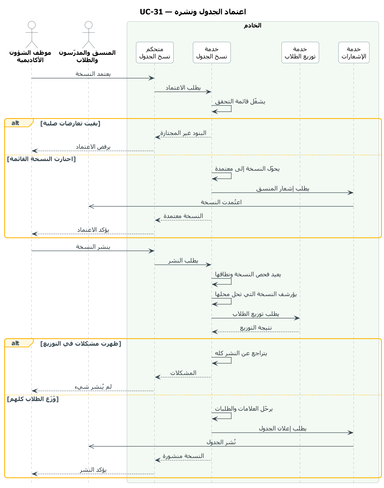

**النسخة الإنجليزية:**

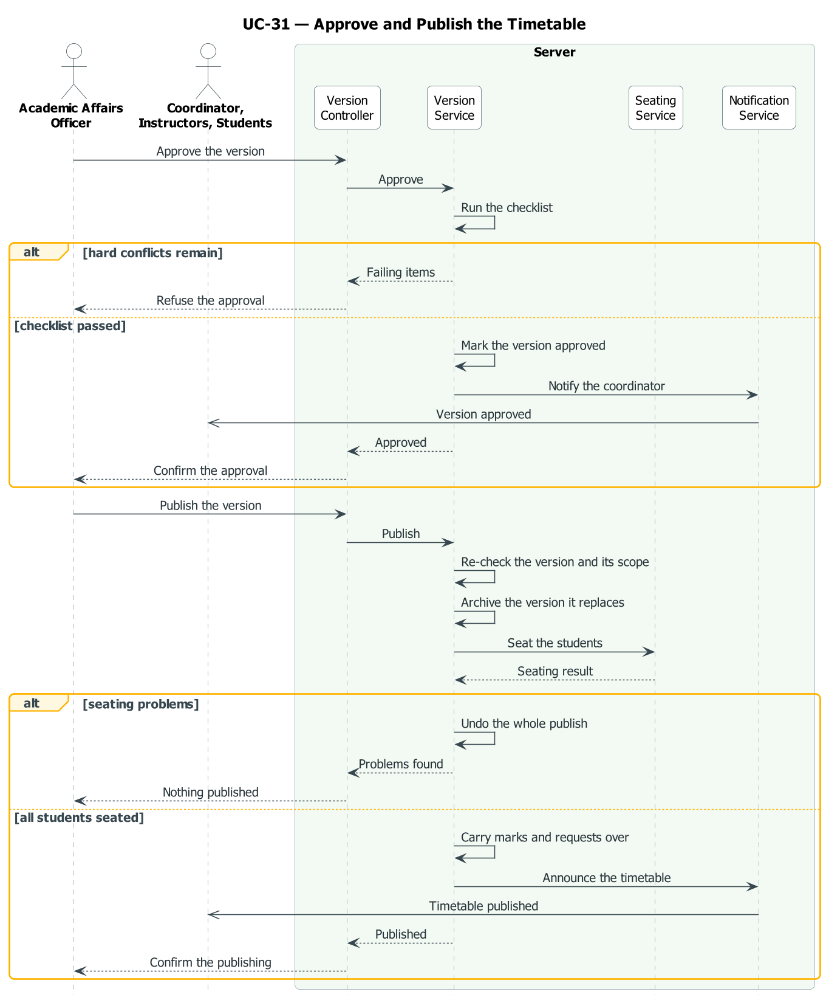

**كود النسخة العربية:**

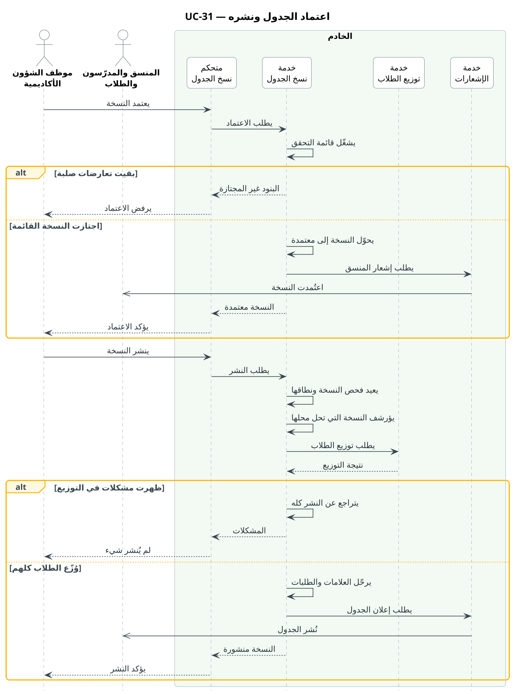
```plantuml
@startuml UC-31_approve_publish_schedule
skinparam dpi 150
' ===== النمط الموحّد (مثل مخططات النشاط) =====
skinparam defaultFontName Tahoma
skinparam defaultFontSize 13
skinparam shadowing false
skinparam roundcorner 10
skinparam ArrowColor #37474F
skinparam ArrowFontColor #263238
skinparam TitleFontSize 16
skinparam TitleFontStyle bold
skinparam ParticipantBackgroundColor #FFFFFF
skinparam ParticipantBorderColor #546E7A
skinparam ParticipantFontSize 13
skinparam ActorBackgroundColor #FFFFFF
skinparam ActorBorderColor #37474F
skinparam ActorFontSize 13
skinparam ActorFontStyle bold
skinparam SequenceLifeLineBorderColor #90A4AE
skinparam SequenceBoxBorderColor #90A4AE
skinparam SequenceBoxFontSize 14
skinparam SequenceBoxFontStyle bold
skinparam SequenceGroupBorderColor #FFB300
skinparam SequenceGroupBackgroundColor #FFF8E1
skinparam SequenceGroupFontColor #37474F
skinparam SequenceGroupHeaderFontColor #37474F
skinparam sequenceMessageAlign center
skinparam ParticipantPadding 16
skinparam BoxPadding 12
hide footbox
' ===== المخطط =====
title UC-31 — اعتماد الجدول ونشره

actor "موظف الشؤون\nالأكاديمية" as U
actor "المنسق والمدرّسون\nوالطلاب" as R
box "الخادم" #F3FAF3
  participant "متحكم\nنسخ الجدول" as VC
  participant "خدمة\nنسخ الجدول" as VS
  participant "خدمة\nتوزيع الطلاب" as SS
  participant "خدمة\nالإشعارات" as NS
end box

U -> VC : يعتمد النسخة
VC -> VS : يطلب الاعتماد
VS -> VS : يشغّل قائمة التحقق
alt بقيت تعارضات صلبة
  VS --> VC : البنود غير المجتازة
  VC --> U : يرفض الاعتماد
else اجتازت النسخة القائمة
  VS -> VS : يحوّل النسخة إلى معتمدة
  VS -> NS : يطلب إشعار المنسق
  NS ->> R : اعتُمدت النسخة
  VS --> VC : النسخة معتمدة
  VC --> U : يؤكد الاعتماد
end
U -> VC : ينشر النسخة
VC -> VS : يطلب النشر
VS -> VS : يعيد فحص النسخة ونطاقها
VS -> VS : يؤرشف النسخة التي تحل محلها
VS -> SS : يطلب توزيع الطلاب
SS --> VS : نتيجة التوزيع
alt ظهرت مشكلات في التوزيع
  VS -> VS : يتراجع عن النشر كله
  VS --> VC : المشكلات
  VC --> U : لم يُنشر شيء
else وُزّع الطلاب كلهم
  VS -> VS : يرحّل العلامات والطلبات
  VS -> NS : يطلب إعلان الجدول
  NS ->> R : نُشر الجدول
  VS --> VC : النسخة منشورة
  VC --> U : يؤكد النشر
end
@enduml
```

**كود النسخة الإنجليزية:**

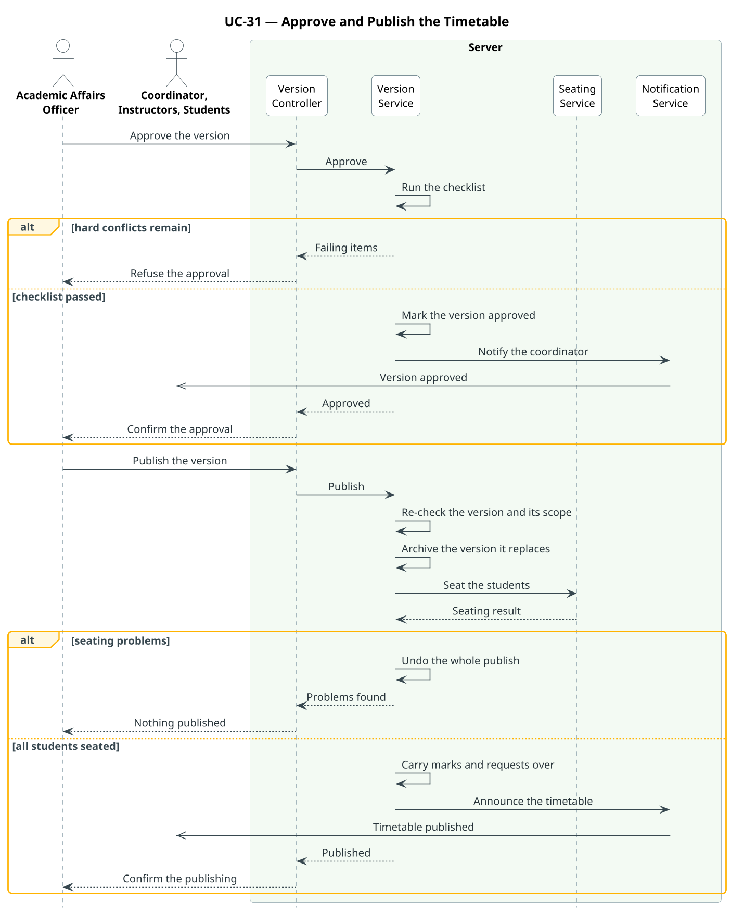
```plantuml
@startuml UC-31_approve_publish_schedule
skinparam dpi 150
' ===== النمط الموحّد (مثل مخططات النشاط) =====
skinparam defaultFontName Tahoma
skinparam defaultFontSize 13
skinparam shadowing false
skinparam roundcorner 10
skinparam ArrowColor #37474F
skinparam ArrowFontColor #263238
skinparam TitleFontSize 16
skinparam TitleFontStyle bold
skinparam ParticipantBackgroundColor #FFFFFF
skinparam ParticipantBorderColor #546E7A
skinparam ParticipantFontSize 13
skinparam ActorBackgroundColor #FFFFFF
skinparam ActorBorderColor #37474F
skinparam ActorFontSize 13
skinparam ActorFontStyle bold
skinparam SequenceLifeLineBorderColor #90A4AE
skinparam SequenceBoxBorderColor #90A4AE
skinparam SequenceBoxFontSize 14
skinparam SequenceBoxFontStyle bold
skinparam SequenceGroupBorderColor #FFB300
skinparam SequenceGroupBackgroundColor #FFF8E1
skinparam SequenceGroupFontColor #37474F
skinparam SequenceGroupHeaderFontColor #37474F
skinparam sequenceMessageAlign center
skinparam ParticipantPadding 16
skinparam BoxPadding 12
hide footbox
' ===== المخطط =====
title UC-31 — Approve and Publish the Timetable

actor "Academic Affairs\nOfficer" as U
actor "Coordinator,\nInstructors, Students" as R
box "Server" #F3FAF3
  participant "Version\nController" as VC
  participant "Version\nService" as VS
  participant "Seating\nService" as SS
  participant "Notification\nService" as NS
end box

U -> VC : Approve the version
VC -> VS : Approve
VS -> VS : Run the checklist
alt hard conflicts remain
  VS --> VC : Failing items
  VC --> U : Refuse the approval
else checklist passed
  VS -> VS : Mark the version approved
  VS -> NS : Notify the coordinator
  NS ->> R : Version approved
  VS --> VC : Approved
  VC --> U : Confirm the approval
end
U -> VC : Publish the version
VC -> VS : Publish
VS -> VS : Re-check the version and its scope
VS -> VS : Archive the version it replaces
VS -> SS : Seat the students
SS --> VS : Seating result
alt seating problems
  VS -> VS : Undo the whole publish
  VS --> VC : Problems found
  VC --> U : Nothing published
else all students seated
  VS -> VS : Carry marks and requests over
  VS -> NS : Announce the timetable
  NS ->> R : Timetable published
  VS --> VC : Published
  VC --> U : Confirm the publishing
end
@enduml
```

---

## UC-67: تسجيل المقررات

**الفاعل:** الطالب. **ما يجري في الخادم:** يفحص فاحص الأهلية كل إضافة إلى السلة (النافذة والعوائق والمتطلبات والتعارضات والساعات)، ثم يُحجز المقعد مؤقتاً. وعند التأكيد يتجاهل المتحكم الطلب المكرر ويعيد فحص السلة كلها، ثم تحجز خدمة تأكيد السلة المقاعد كلها في عملية واحدة، فتتراجع إن امتلأت شعبة، وإلا أنشأت التسجيلات وأصدرت الفاتورة وأعادت رقم التأكيد.

**النسخة العربية:**

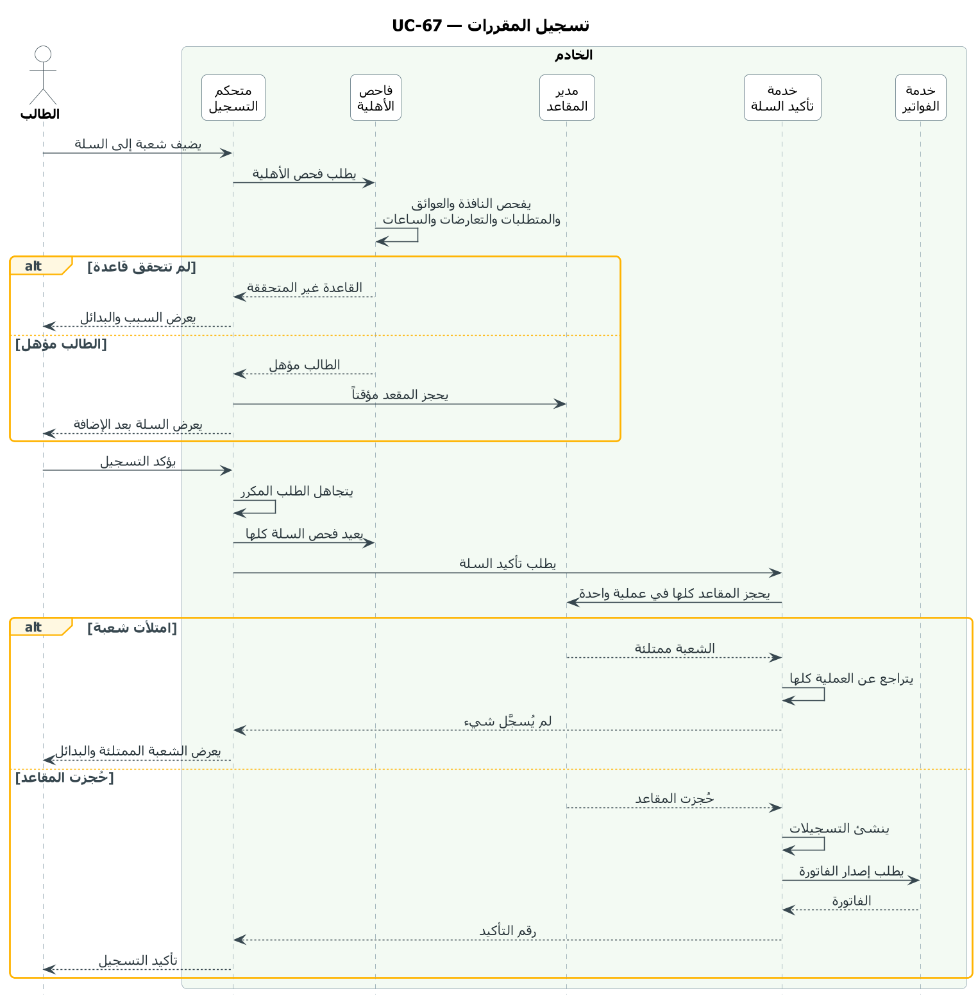

**النسخة الإنجليزية:**

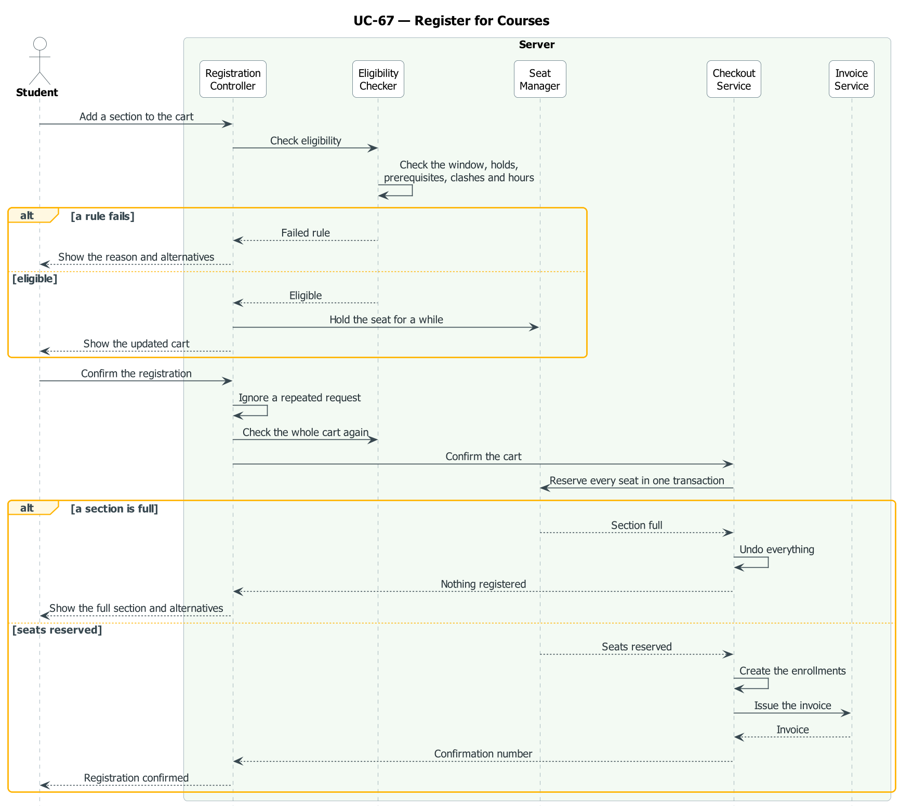

**كود النسخة العربية:**

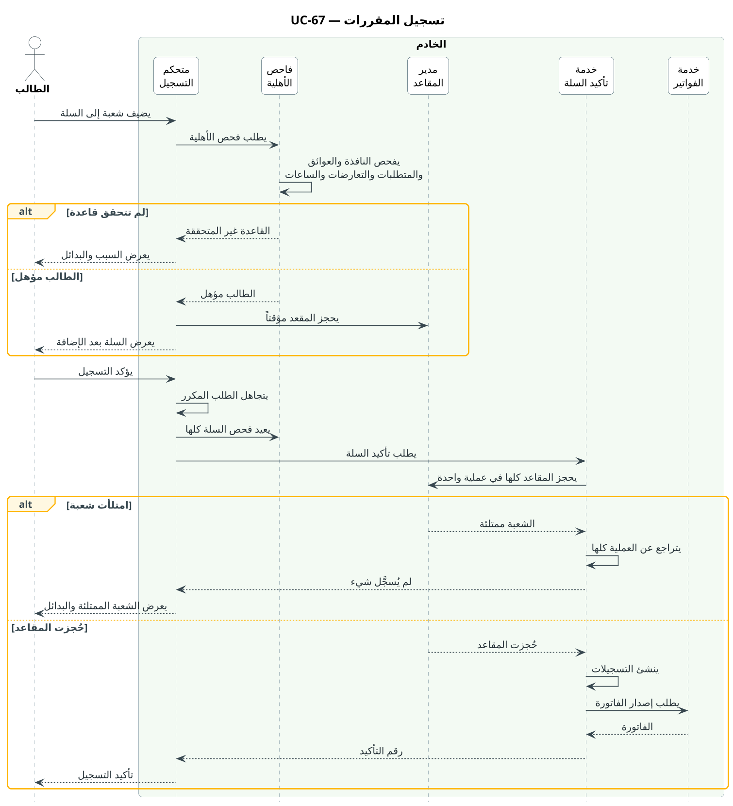
```plantuml
@startuml UC-67_course_registration
skinparam dpi 150
' ===== النمط الموحّد (مثل مخططات النشاط) =====
skinparam defaultFontName Tahoma
skinparam defaultFontSize 13
skinparam shadowing false
skinparam roundcorner 10
skinparam ArrowColor #37474F
skinparam ArrowFontColor #263238
skinparam TitleFontSize 16
skinparam TitleFontStyle bold
skinparam ParticipantBackgroundColor #FFFFFF
skinparam ParticipantBorderColor #546E7A
skinparam ParticipantFontSize 13
skinparam ActorBackgroundColor #FFFFFF
skinparam ActorBorderColor #37474F
skinparam ActorFontSize 13
skinparam ActorFontStyle bold
skinparam SequenceLifeLineBorderColor #90A4AE
skinparam SequenceBoxBorderColor #90A4AE
skinparam SequenceBoxFontSize 14
skinparam SequenceBoxFontStyle bold
skinparam SequenceGroupBorderColor #FFB300
skinparam SequenceGroupBackgroundColor #FFF8E1
skinparam SequenceGroupFontColor #37474F
skinparam SequenceGroupHeaderFontColor #37474F
skinparam sequenceMessageAlign center
skinparam ParticipantPadding 16
skinparam BoxPadding 12
hide footbox
' ===== المخطط =====
title UC-67 — تسجيل المقررات

actor "الطالب" as U
box "الخادم" #F3FAF3
  participant "متحكم\nالتسجيل" as RC
  participant "فاحص\nالأهلية" as EC
  participant "مدير\nالمقاعد" as SM
  participant "خدمة\nتأكيد السلة" as CS
  participant "خدمة\nالفواتير" as IS
end box

U -> RC : يضيف شعبة إلى السلة
RC -> EC : يطلب فحص الأهلية
EC -> EC : يفحص النافذة والعوائق\nوالمتطلبات والتعارضات والساعات
alt لم تتحقق قاعدة
  EC --> RC : القاعدة غير المتحققة
  RC --> U : يعرض السبب والبدائل
else الطالب مؤهل
  EC --> RC : الطالب مؤهل
  RC -> SM : يحجز المقعد مؤقتاً
  RC --> U : يعرض السلة بعد الإضافة
end
U -> RC : يؤكد التسجيل
RC -> RC : يتجاهل الطلب المكرر
RC -> EC : يعيد فحص السلة كلها
RC -> CS : يطلب تأكيد السلة
CS -> SM : يحجز المقاعد كلها في عملية واحدة
alt امتلأت شعبة
  SM --> CS : الشعبة ممتلئة
  CS -> CS : يتراجع عن العملية كلها
  CS --> RC : لم يُسجَّل شيء
  RC --> U : يعرض الشعبة الممتلئة والبدائل
else حُجزت المقاعد
  SM --> CS : حُجزت المقاعد
  CS -> CS : ينشئ التسجيلات
  CS -> IS : يطلب إصدار الفاتورة
  IS --> CS : الفاتورة
  CS --> RC : رقم التأكيد
  RC --> U : تأكيد التسجيل
end
@enduml
```

**كود النسخة الإنجليزية:**

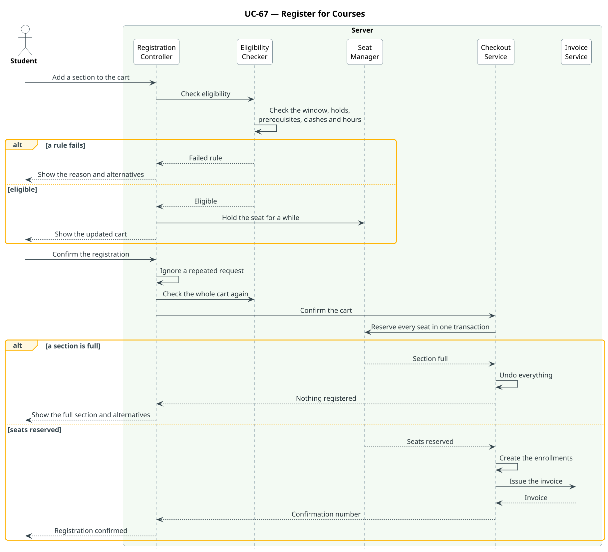
```plantuml
@startuml UC-67_course_registration
skinparam dpi 150
' ===== النمط الموحّد (مثل مخططات النشاط) =====
skinparam defaultFontName Tahoma
skinparam defaultFontSize 13
skinparam shadowing false
skinparam roundcorner 10
skinparam ArrowColor #37474F
skinparam ArrowFontColor #263238
skinparam TitleFontSize 16
skinparam TitleFontStyle bold
skinparam ParticipantBackgroundColor #FFFFFF
skinparam ParticipantBorderColor #546E7A
skinparam ParticipantFontSize 13
skinparam ActorBackgroundColor #FFFFFF
skinparam ActorBorderColor #37474F
skinparam ActorFontSize 13
skinparam ActorFontStyle bold
skinparam SequenceLifeLineBorderColor #90A4AE
skinparam SequenceBoxBorderColor #90A4AE
skinparam SequenceBoxFontSize 14
skinparam SequenceBoxFontStyle bold
skinparam SequenceGroupBorderColor #FFB300
skinparam SequenceGroupBackgroundColor #FFF8E1
skinparam SequenceGroupFontColor #37474F
skinparam SequenceGroupHeaderFontColor #37474F
skinparam sequenceMessageAlign center
skinparam ParticipantPadding 16
skinparam BoxPadding 12
hide footbox
' ===== المخطط =====
title UC-67 — Register for Courses

actor "Student" as U
box "Server" #F3FAF3
  participant "Registration\nController" as RC
  participant "Eligibility\nChecker" as EC
  participant "Seat\nManager" as SM
  participant "Checkout\nService" as CS
  participant "Invoice\nService" as IS
end box

U -> RC : Add a section to the cart
RC -> EC : Check eligibility
EC -> EC : Check the window, holds,\nprerequisites, clashes and hours
alt a rule fails
  EC --> RC : Failed rule
  RC --> U : Show the reason and alternatives
else eligible
  EC --> RC : Eligible
  RC -> SM : Hold the seat for a while
  RC --> U : Show the updated cart
end
U -> RC : Confirm the registration
RC -> RC : Ignore a repeated request
RC -> EC : Check the whole cart again
RC -> CS : Confirm the cart
CS -> SM : Reserve every seat in one transaction
alt a section is full
  SM --> CS : Section full
  CS -> CS : Undo everything
  CS --> RC : Nothing registered
  RC --> U : Show the full section and alternatives
else seats reserved
  SM --> CS : Seats reserved
  CS -> CS : Create the enrollments
  CS -> IS : Issue the invoice
  IS --> CS : Invoice
  CS --> RC : Confirmation number
  RC --> U : Registration confirmed
end
@enduml
```

---

## UC-84: جدولة الامتحانات

**الفاعل:** موظف شؤون الامتحانات. **ما يجري في الخادم:** يتحقق متحكم الامتحانات من الفترة وقواعدها، ويبني منشئ القائمة امتحاناً لكل مقرر. ثم يبني محرك جدولة الامتحانات رسم التعارض من تسجيلات الطلاب، ويوزّع الامتحانات على الفترات بتلوين الرسم، ويباعد بين امتحانات كل طالب. ولا يُنشر الجدول إلا بعد التحقق من التعارضات والمقاعد والمراقبين.

**النسخة العربية:**

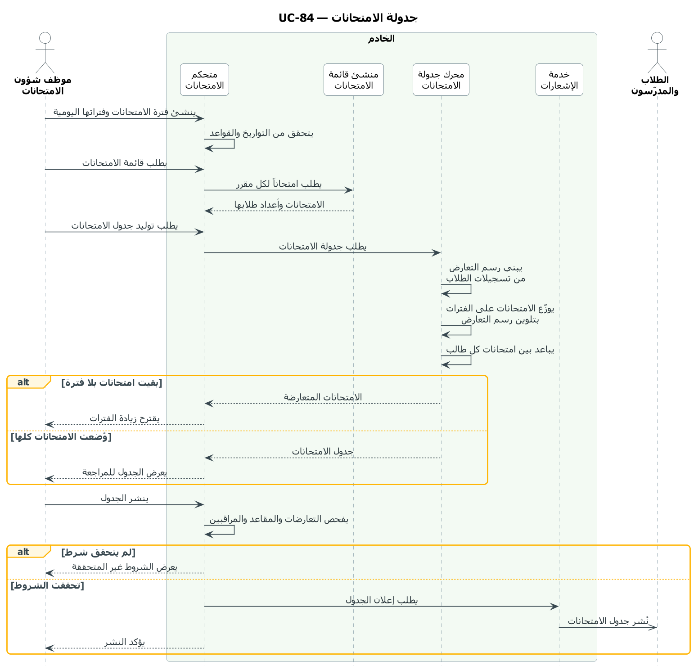

**النسخة الإنجليزية:**

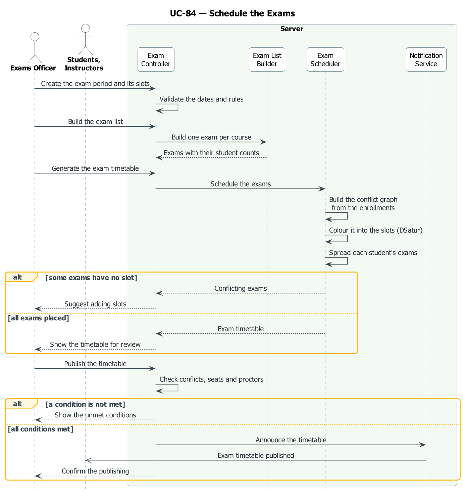

**كود النسخة العربية:**

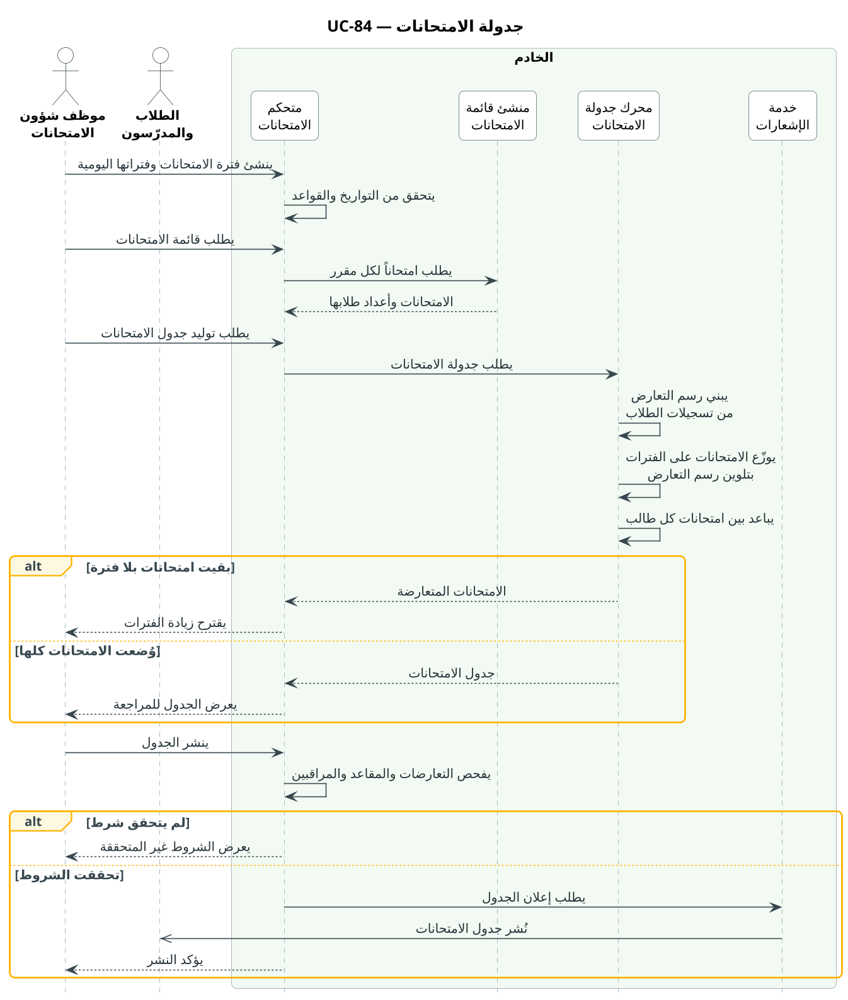
```plantuml
@startuml UC-84_exam_schedule
skinparam dpi 150
' ===== النمط الموحّد (مثل مخططات النشاط) =====
skinparam defaultFontName Tahoma
skinparam defaultFontSize 13
skinparam shadowing false
skinparam roundcorner 10
skinparam ArrowColor #37474F
skinparam ArrowFontColor #263238
skinparam TitleFontSize 16
skinparam TitleFontStyle bold
skinparam ParticipantBackgroundColor #FFFFFF
skinparam ParticipantBorderColor #546E7A
skinparam ParticipantFontSize 13
skinparam ActorBackgroundColor #FFFFFF
skinparam ActorBorderColor #37474F
skinparam ActorFontSize 13
skinparam ActorFontStyle bold
skinparam SequenceLifeLineBorderColor #90A4AE
skinparam SequenceBoxBorderColor #90A4AE
skinparam SequenceBoxFontSize 14
skinparam SequenceBoxFontStyle bold
skinparam SequenceGroupBorderColor #FFB300
skinparam SequenceGroupBackgroundColor #FFF8E1
skinparam SequenceGroupFontColor #37474F
skinparam SequenceGroupHeaderFontColor #37474F
skinparam sequenceMessageAlign center
skinparam ParticipantPadding 16
skinparam BoxPadding 12
hide footbox
' ===== المخطط =====
title UC-84 — جدولة الامتحانات

actor "موظف شؤون\nالامتحانات" as U
actor "الطلاب\nوالمدرّسون" as R
box "الخادم" #F3FAF3
  participant "متحكم\nالامتحانات" as EX
  participant "منشئ قائمة\nالامتحانات" as LB
  participant "محرك جدولة\nالامتحانات" as ES
  participant "خدمة\nالإشعارات" as NS
end box

U -> EX : ينشئ فترة الامتحانات وفتراتها اليومية
EX -> EX : يتحقق من التواريخ والقواعد
U -> EX : يطلب قائمة الامتحانات
EX -> LB : يطلب امتحاناً لكل مقرر
LB --> EX : الامتحانات وأعداد طلابها
U -> EX : يطلب توليد جدول الامتحانات
EX -> ES : يطلب جدولة الامتحانات
ES -> ES : يبني رسم التعارض\nمن تسجيلات الطلاب
ES -> ES : يوزّع الامتحانات على الفترات\nبتلوين رسم التعارض
ES -> ES : يباعد بين امتحانات كل طالب
alt بقيت امتحانات بلا فترة
  ES --> EX : الامتحانات المتعارضة
  EX --> U : يقترح زيادة الفترات
else وُضعت الامتحانات كلها
  ES --> EX : جدول الامتحانات
  EX --> U : يعرض الجدول للمراجعة
end
U -> EX : ينشر الجدول
EX -> EX : يفحص التعارضات والمقاعد والمراقبين
alt لم يتحقق شرط
  EX --> U : يعرض الشروط غير المتحققة
else تحققت الشروط
  EX -> NS : يطلب إعلان الجدول
  NS ->> R : نُشر جدول الامتحانات
  EX --> U : يؤكد النشر
end
@enduml
```

**كود النسخة الإنجليزية:**

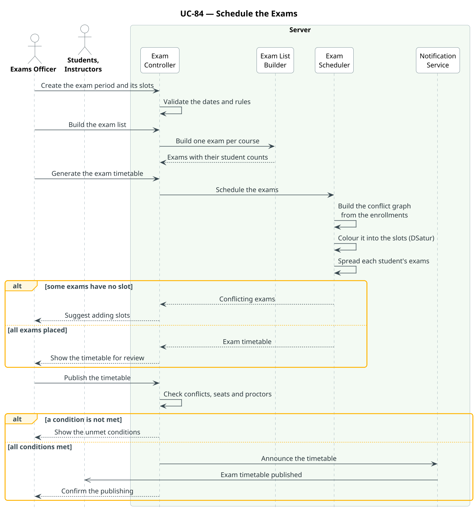
```plantuml
@startuml UC-84_exam_schedule
skinparam dpi 150
' ===== النمط الموحّد (مثل مخططات النشاط) =====
skinparam defaultFontName Tahoma
skinparam defaultFontSize 13
skinparam shadowing false
skinparam roundcorner 10
skinparam ArrowColor #37474F
skinparam ArrowFontColor #263238
skinparam TitleFontSize 16
skinparam TitleFontStyle bold
skinparam ParticipantBackgroundColor #FFFFFF
skinparam ParticipantBorderColor #546E7A
skinparam ParticipantFontSize 13
skinparam ActorBackgroundColor #FFFFFF
skinparam ActorBorderColor #37474F
skinparam ActorFontSize 13
skinparam ActorFontStyle bold
skinparam SequenceLifeLineBorderColor #90A4AE
skinparam SequenceBoxBorderColor #90A4AE
skinparam SequenceBoxFontSize 14
skinparam SequenceBoxFontStyle bold
skinparam SequenceGroupBorderColor #FFB300
skinparam SequenceGroupBackgroundColor #FFF8E1
skinparam SequenceGroupFontColor #37474F
skinparam SequenceGroupHeaderFontColor #37474F
skinparam sequenceMessageAlign center
skinparam ParticipantPadding 16
skinparam BoxPadding 12
hide footbox
' ===== المخطط =====
title UC-84 — Schedule the Exams

actor "Exams Officer" as U
actor "Students,\nInstructors" as R
box "Server" #F3FAF3
  participant "Exam\nController" as EX
  participant "Exam List\nBuilder" as LB
  participant "Exam\nScheduler" as ES
  participant "Notification\nService" as NS
end box

U -> EX : Create the exam period and its slots
EX -> EX : Validate the dates and rules
U -> EX : Build the exam list
EX -> LB : Build one exam per course
LB --> EX : Exams with their student counts
U -> EX : Generate the exam timetable
EX -> ES : Schedule the exams
ES -> ES : Build the conflict graph\nfrom the enrollments
ES -> ES : Colour it into the slots (DSatur)
ES -> ES : Spread each student's exams
alt some exams have no slot
  ES --> EX : Conflicting exams
  EX --> U : Suggest adding slots
else all exams placed
  ES --> EX : Exam timetable
  EX --> U : Show the timetable for review
end
U -> EX : Publish the timetable
EX -> EX : Check conflicts, seats and proctors
alt a condition is not met
  EX --> U : Show the unmet conditions
else all conditions met
  EX -> NS : Announce the timetable
  NS ->> R : Exam timetable published
  EX --> U : Confirm the publishing
end
@enduml
```

---

## UC-80: الإدخال المزدوج واعتماد الكشوف ونشرها

**الفاعل:** موظف شؤون الامتحانات. **ما يجري في الخادم:** تحفظ خدمة التحقق الإدخال الثاني لعلامة الامتحان النهائي وتقارنه بإدخال المدرّس، ويُحل كل فرق بحفظ العلامة في دفتر العلامات الذي يعيد حساب المجموع والتقدير. ولا يُعتمد الكشف قبل حل الفروقات، ويتطلب النشر كلمة مرور الموظف، ثم تنشر مهمة في الخلفية الكشوف وتحدّث المعدل والوضع الأكاديمي وتُشعر الطلاب.

**النسخة العربية:**

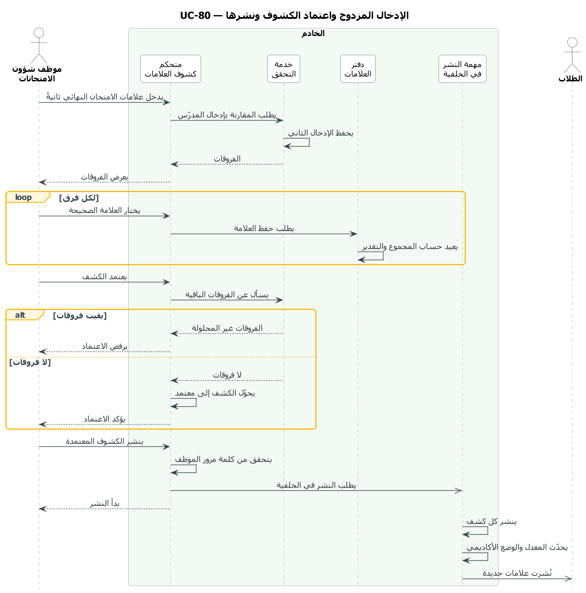

**النسخة الإنجليزية:**

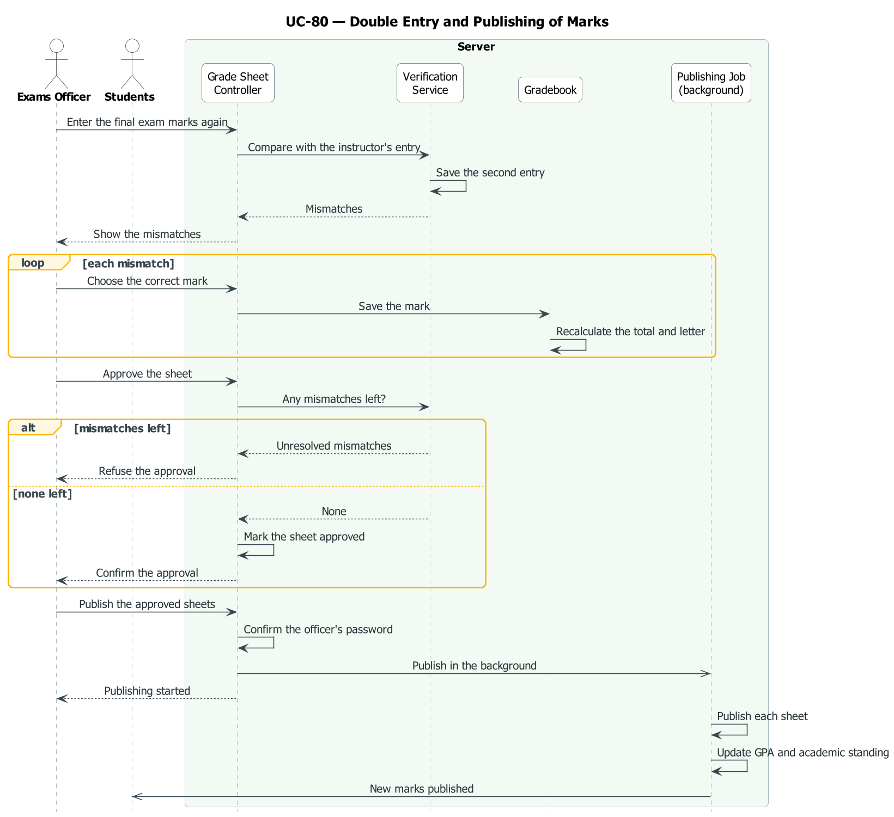

**كود النسخة العربية:**

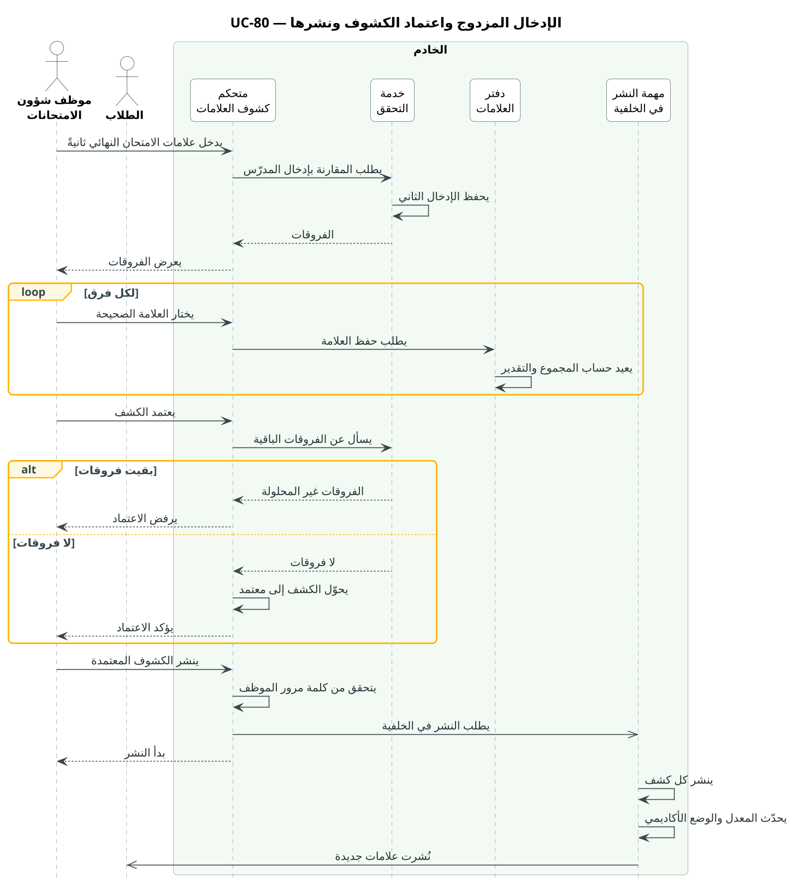
```plantuml
@startuml UC-80_verify_publish_grades
skinparam dpi 150
' ===== النمط الموحّد (مثل مخططات النشاط) =====
skinparam defaultFontName Tahoma
skinparam defaultFontSize 13
skinparam shadowing false
skinparam roundcorner 10
skinparam ArrowColor #37474F
skinparam ArrowFontColor #263238
skinparam TitleFontSize 16
skinparam TitleFontStyle bold
skinparam ParticipantBackgroundColor #FFFFFF
skinparam ParticipantBorderColor #546E7A
skinparam ParticipantFontSize 13
skinparam ActorBackgroundColor #FFFFFF
skinparam ActorBorderColor #37474F
skinparam ActorFontSize 13
skinparam ActorFontStyle bold
skinparam SequenceLifeLineBorderColor #90A4AE
skinparam SequenceBoxBorderColor #90A4AE
skinparam SequenceBoxFontSize 14
skinparam SequenceBoxFontStyle bold
skinparam SequenceGroupBorderColor #FFB300
skinparam SequenceGroupBackgroundColor #FFF8E1
skinparam SequenceGroupFontColor #37474F
skinparam SequenceGroupHeaderFontColor #37474F
skinparam sequenceMessageAlign center
skinparam ParticipantPadding 16
skinparam BoxPadding 12
hide footbox
' ===== المخطط =====
title UC-80 — الإدخال المزدوج واعتماد الكشوف ونشرها

actor "موظف شؤون\nالامتحانات" as U
actor "الطلاب" as R
box "الخادم" #F3FAF3
  participant "متحكم\nكشوف العلامات" as GC
  participant "خدمة\nالتحقق" as VS
  participant "دفتر\nالعلامات" as GB
  participant "مهمة النشر\nفي الخلفية" as PJ
end box

U -> GC : يدخل علامات الامتحان النهائي ثانيةً
GC -> VS : يطلب المقارنة بإدخال المدرّس
VS -> VS : يحفظ الإدخال الثاني
VS --> GC : الفروقات
GC --> U : يعرض الفروقات
loop لكل فرق
  U -> GC : يختار العلامة الصحيحة
  GC -> GB : يطلب حفظ العلامة
  GB -> GB : يعيد حساب المجموع والتقدير
end
U -> GC : يعتمد الكشف
GC -> VS : يسأل عن الفروقات الباقية
alt بقيت فروقات
  VS --> GC : الفروقات غير المحلولة
  GC --> U : يرفض الاعتماد
else لا فروقات
  VS --> GC : لا فروقات
  GC -> GC : يحوّل الكشف إلى معتمد
  GC --> U : يؤكد الاعتماد
end
U -> GC : ينشر الكشوف المعتمدة
GC -> GC : يتحقق من كلمة مرور الموظف
GC ->> PJ : يطلب النشر في الخلفية
GC --> U : بدأ النشر
PJ -> PJ : ينشر كل كشف
PJ -> PJ : يحدّث المعدل والوضع الأكاديمي
PJ ->> R : نُشرت علامات جديدة
@enduml
```

**كود النسخة الإنجليزية:**

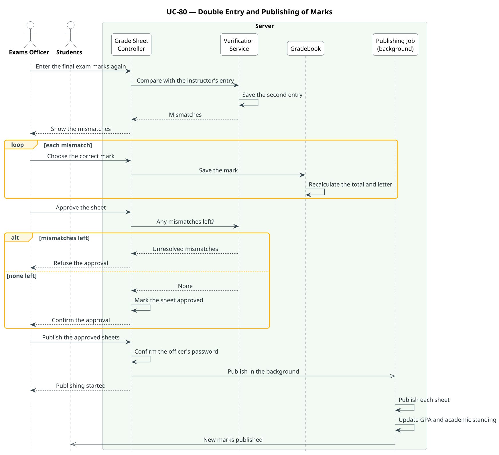
```plantuml
@startuml UC-80_verify_publish_grades
skinparam dpi 150
' ===== النمط الموحّد (مثل مخططات النشاط) =====
skinparam defaultFontName Tahoma
skinparam defaultFontSize 13
skinparam shadowing false
skinparam roundcorner 10
skinparam ArrowColor #37474F
skinparam ArrowFontColor #263238
skinparam TitleFontSize 16
skinparam TitleFontStyle bold
skinparam ParticipantBackgroundColor #FFFFFF
skinparam ParticipantBorderColor #546E7A
skinparam ParticipantFontSize 13
skinparam ActorBackgroundColor #FFFFFF
skinparam ActorBorderColor #37474F
skinparam ActorFontSize 13
skinparam ActorFontStyle bold
skinparam SequenceLifeLineBorderColor #90A4AE
skinparam SequenceBoxBorderColor #90A4AE
skinparam SequenceBoxFontSize 14
skinparam SequenceBoxFontStyle bold
skinparam SequenceGroupBorderColor #FFB300
skinparam SequenceGroupBackgroundColor #FFF8E1
skinparam SequenceGroupFontColor #37474F
skinparam SequenceGroupHeaderFontColor #37474F
skinparam sequenceMessageAlign center
skinparam ParticipantPadding 16
skinparam BoxPadding 12
hide footbox
' ===== المخطط =====
title UC-80 — Double Entry and Publishing of Marks

actor "Exams Officer" as U
actor "Students" as R
box "Server" #F3FAF3
  participant "Grade Sheet\nController" as GC
  participant "Verification\nService" as VS
  participant "Gradebook" as GB
  participant "Publishing Job\n(background)" as PJ
end box

U -> GC : Enter the final exam marks again
GC -> VS : Compare with the instructor's entry
VS -> VS : Save the second entry
VS --> GC : Mismatches
GC --> U : Show the mismatches
loop each mismatch
  U -> GC : Choose the correct mark
  GC -> GB : Save the mark
  GB -> GB : Recalculate the total and letter
end
U -> GC : Approve the sheet
GC -> VS : Any mismatches left?
alt mismatches left
  VS --> GC : Unresolved mismatches
  GC --> U : Refuse the approval
else none left
  VS --> GC : None
  GC -> GC : Mark the sheet approved
  GC --> U : Confirm the approval
end
U -> GC : Publish the approved sheets
GC -> GC : Confirm the officer's password
GC ->> PJ : Publish in the background
GC --> U : Publishing started
PJ -> PJ : Publish each sheet
PJ -> PJ : Update GPA and academic standing
PJ ->> R : New marks published
@enduml
```

---

## UC-105: محادثة المساعد الذكي

**الفاعل:** أي مستخدم في النظام. **ما يجري في الخادم:** تتحقق بوابة الذكاء من صلاحية المستخدم وحصته اليومية. ثم يرسل المساعد المحادثة والأدوات المتاحة إلى خدمة الذكاء الاصطناعي التي تسأل النموذج اللغوي، وكل أداة يطلبها النموذج ينفّذها منفّذ الأدوات بصلاحيات المستخدم نفسه. وتُحفظ الإجابة واستهلاكها، وتُعرض للمستخدم مع مصادرها.

**النسخة العربية:**

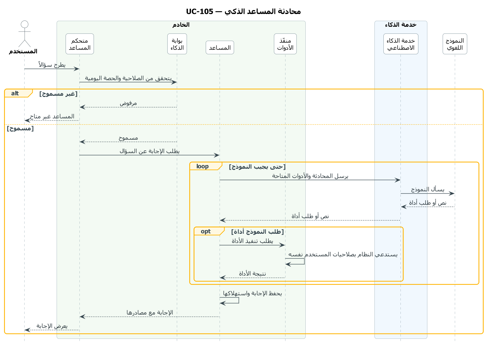

**النسخة الإنجليزية:**

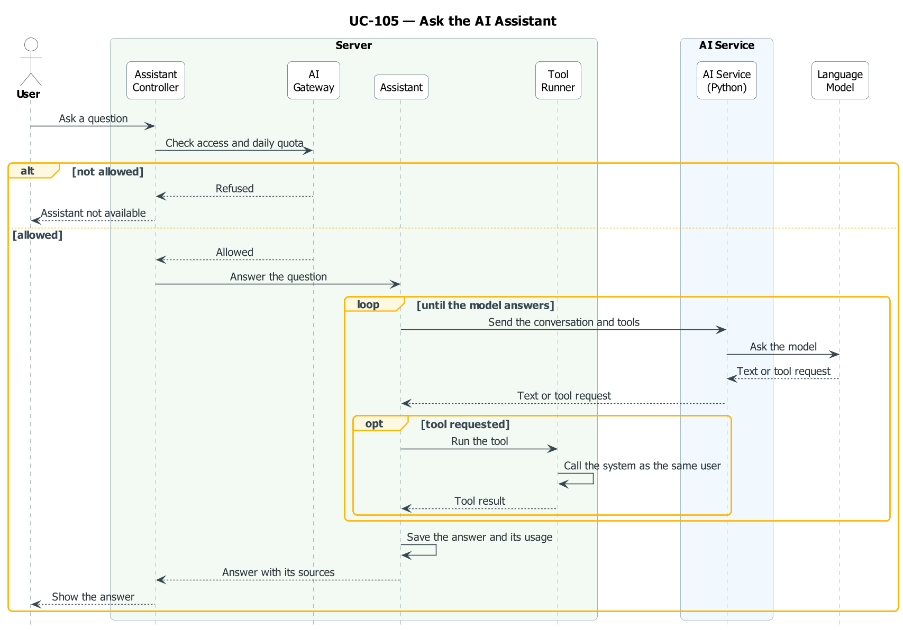

**كود النسخة العربية:**

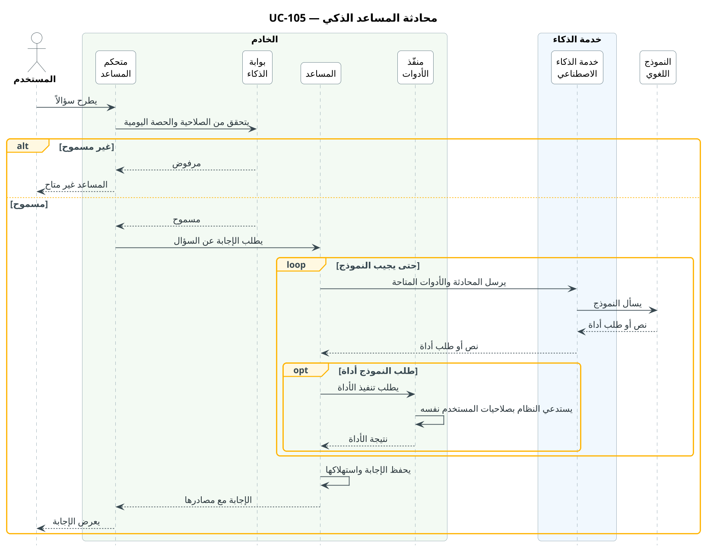
```plantuml
@startuml UC-105_ai_assistant
skinparam dpi 150
' ===== النمط الموحّد (مثل مخططات النشاط) =====
skinparam defaultFontName Tahoma
skinparam defaultFontSize 13
skinparam shadowing false
skinparam roundcorner 10
skinparam ArrowColor #37474F
skinparam ArrowFontColor #263238
skinparam TitleFontSize 16
skinparam TitleFontStyle bold
skinparam ParticipantBackgroundColor #FFFFFF
skinparam ParticipantBorderColor #546E7A
skinparam ParticipantFontSize 13
skinparam ActorBackgroundColor #FFFFFF
skinparam ActorBorderColor #37474F
skinparam ActorFontSize 13
skinparam ActorFontStyle bold
skinparam SequenceLifeLineBorderColor #90A4AE
skinparam SequenceBoxBorderColor #90A4AE
skinparam SequenceBoxFontSize 14
skinparam SequenceBoxFontStyle bold
skinparam SequenceGroupBorderColor #FFB300
skinparam SequenceGroupBackgroundColor #FFF8E1
skinparam SequenceGroupFontColor #37474F
skinparam SequenceGroupHeaderFontColor #37474F
skinparam sequenceMessageAlign center
skinparam ParticipantPadding 16
skinparam BoxPadding 12
hide footbox
' ===== المخطط =====
title UC-105 — محادثة المساعد الذكي

actor "المستخدم" as U
box "الخادم" #F3FAF3
  participant "متحكم\nالمساعد" as AC
  participant "بوابة\nالذكاء" as GW
  participant "المساعد" as AS
  participant "منفّذ\nالأدوات" as TR
end box
box "خدمة الذكاء" #F1F8FE
  participant "خدمة الذكاء\nالاصطناعي" as PY
end box
participant "النموذج\nاللغوي" as LLM

U -> AC : يطرح سؤالاً
AC -> GW : يتحقق من الصلاحية والحصة اليومية
alt غير مسموح
  GW --> AC : مرفوض
  AC --> U : المساعد غير متاح
else مسموح
  GW --> AC : مسموح
  AC -> AS : يطلب الإجابة عن السؤال
  loop حتى يجيب النموذج
    AS -> PY : يرسل المحادثة والأدوات المتاحة
    PY -> LLM : يسأل النموذج
    LLM --> PY : نص أو طلب أداة
    PY --> AS : نص أو طلب أداة
    opt طلب النموذج أداة
      AS -> TR : يطلب تنفيذ الأداة
      TR -> TR : يستدعي النظام بصلاحيات المستخدم نفسه
      TR --> AS : نتيجة الأداة
    end
  end
  AS -> AS : يحفظ الإجابة واستهلاكها
  AS --> AC : الإجابة مع مصادرها
  AC --> U : يعرض الإجابة
end
@enduml
```

**كود النسخة الإنجليزية:**

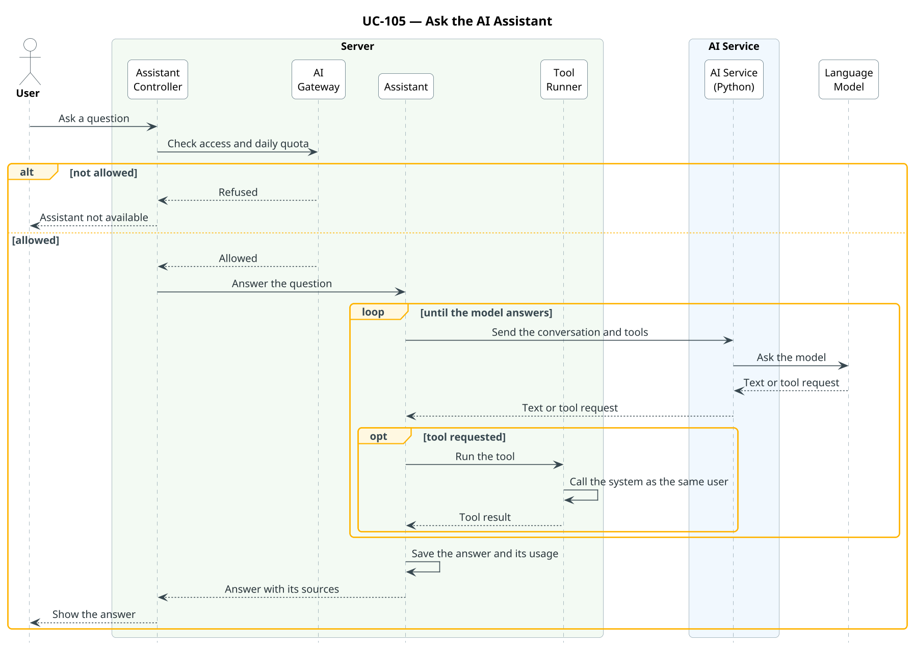
```plantuml
@startuml UC-105_ai_assistant
skinparam dpi 150
' ===== النمط الموحّد (مثل مخططات النشاط) =====
skinparam defaultFontName Tahoma
skinparam defaultFontSize 13
skinparam shadowing false
skinparam roundcorner 10
skinparam ArrowColor #37474F
skinparam ArrowFontColor #263238
skinparam TitleFontSize 16
skinparam TitleFontStyle bold
skinparam ParticipantBackgroundColor #FFFFFF
skinparam ParticipantBorderColor #546E7A
skinparam ParticipantFontSize 13
skinparam ActorBackgroundColor #FFFFFF
skinparam ActorBorderColor #37474F
skinparam ActorFontSize 13
skinparam ActorFontStyle bold
skinparam SequenceLifeLineBorderColor #90A4AE
skinparam SequenceBoxBorderColor #90A4AE
skinparam SequenceBoxFontSize 14
skinparam SequenceBoxFontStyle bold
skinparam SequenceGroupBorderColor #FFB300
skinparam SequenceGroupBackgroundColor #FFF8E1
skinparam SequenceGroupFontColor #37474F
skinparam SequenceGroupHeaderFontColor #37474F
skinparam sequenceMessageAlign center
skinparam ParticipantPadding 16
skinparam BoxPadding 12
hide footbox
' ===== المخطط =====
title UC-105 — Ask the AI Assistant

actor "User" as U
box "Server" #F3FAF3
  participant "Assistant\nController" as AC
  participant "AI\nGateway" as GW
  participant "Assistant" as AS
  participant "Tool\nRunner" as TR
end box
box "AI Service" #F1F8FE
  participant "AI Service\n(Python)" as PY
end box
participant "Language\nModel" as LLM

U -> AC : Ask a question
AC -> GW : Check access and daily quota
alt not allowed
  GW --> AC : Refused
  AC --> U : Assistant not available
else allowed
  GW --> AC : Allowed
  AC -> AS : Answer the question
  loop until the model answers
    AS -> PY : Send the conversation and tools
    PY -> LLM : Ask the model
    LLM --> PY : Text or tool request
    PY --> AS : Text or tool request
    opt tool requested
      AS -> TR : Run the tool
      TR -> TR : Call the system as the same user
      TR --> AS : Tool result
    end
  end
  AS -> AS : Save the answer and its usage
  AS --> AC : Answer with its sources
  AC --> U : Show the answer
end
@enduml
```

---

